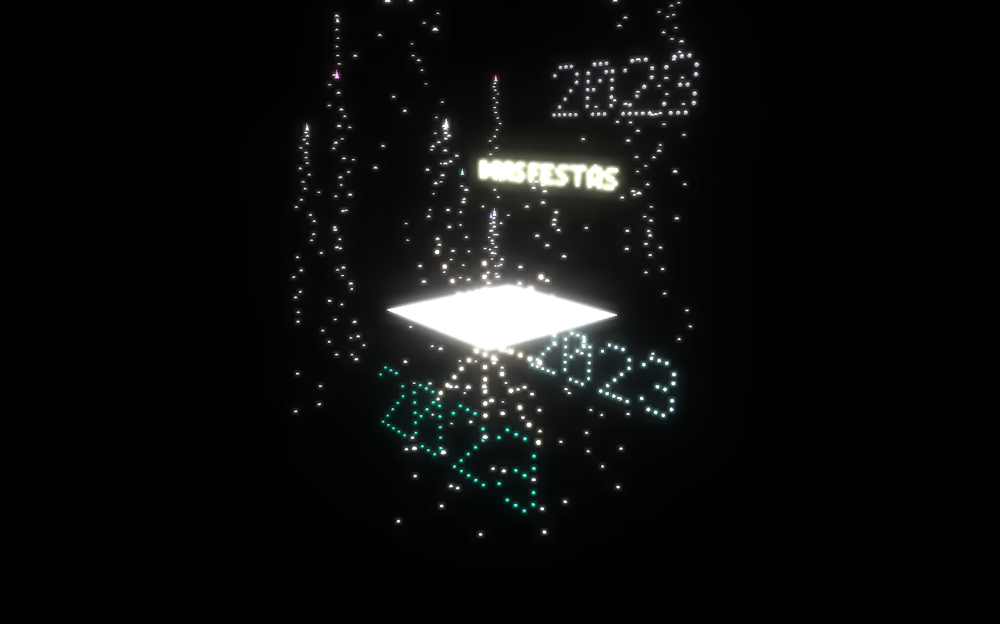
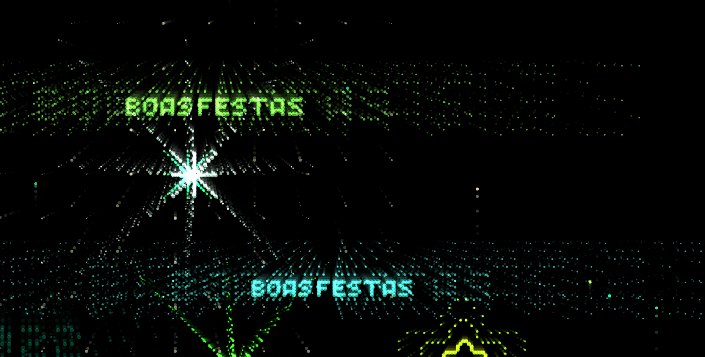

<h1 align="center">Fireworks</h1>

<h2 align="center">Simples animação de fogos de artifício feito com Javascript e Canvas HTML5.</h2>

  <h3 >2024</h3>
  
  

<a href='https://alex5ander.github.io/Fireworks/dist/2024/'>Executar</a>

  <h3 >2023</h3>

  

<a href='https://alex5ander.github.io/Fireworks/dist/2023/'>Executar</a>

  <h3>2022</h3>

  
  
  <a href='https://alex5ander.github.io/Fireworks/dist/2022/'>Executar</a>

